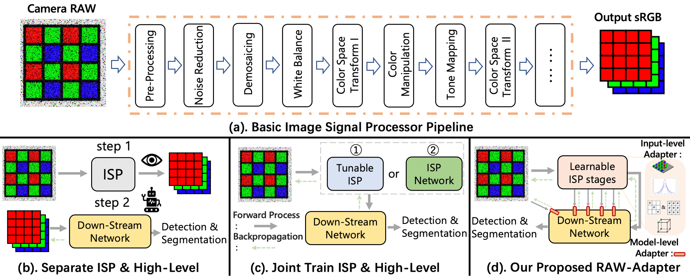

# [ECCV 2024] RAW-Adapter: Adapting Pre-trained Visual Model to Camera RAW Images [(Paper)]() [(Website)](https://cuiziteng.github.io/RAW_Adapter_web/)

[Ziteng Cui1](https://cuiziteng.github.io/), 
[Tatsuya Harada1,2](https://www.mi.t.u-tokyo.ac.jp/harada/). 

1.The University of Tokyo, 2.RIKEN AIP

 

Code & Paper release date is around mid August, thanks for your waiting !

**2024.07.04 :** Paper accepted by **ECCV 2024** ! 

## 🦆: Abstract 

sRGB images are now the predominant choice for pre-training visual models in computer vision research, owing to their ease of acquisition and efficient storage. Meanwhile, the advantage of RAW images lies in their rich physical information under variable real-world lighting conditions. For computer vision tasks directly based on camera RAW data, most existing studies adopt methods of integrating image signal processor (ISP) with backend networks, yet often overlook the interaction capabilities between the ISP stages and subsequent networks. Drawing inspiration from ongoing adapter research in NLP and CV areas, we introduce RAW-Adapter, a novel approach aimed at adapting sRGB pre-trained models to camera RAW data. RAW-Adapter comprises input-level adapters that employ learnable ISP stages to adjust RAW inputs, as well as model-level adapters to build connections between ISP stages and subsequent high-level networks. Additionally, RAW-Adapter is a general framework that could be used in various computer vision frameworks. Abundant experiments under different lighting conditions have shown our algorithm’s state-of-the-art (SOTA) performance, demonstrating its effectiveness and efficiency across a range of real-world and synthetic datasets.

  

Fig.1 (a). An overview of basic image signal processor (ISP) pipeline. (b). ISP and current visual model have different objectives. (c) Previous methods optimize ISP with down-stream visual model. (d) Our proposed RAW-Adapter.

